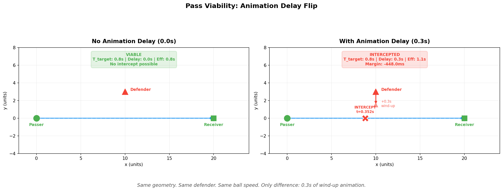

# Decision Window Engine

**A deterministic execution-timing evaluator that predicts whether an action (pass or drive) remains valid through execution — not just at input time.**

Sports game AI often evaluates openness at input time instead of whether the action will still be valid when it completes. This system models the gap between when a player commits to an action and when it finishes executing, accounting for animation delay, motion prediction, and defender interception.

## Quick Start

```bash
git clone <repo-url>
cd decision_window
pip install -r requirements.txt   # optional — core has zero dependencies
python demo_runner.py
```

Expected output:

```
Decision Window Engine v0.2 — Pass Viability
---------------------------------------------------------------------------------
Scenario                  Viable  T_target   Anim  Eff_time  Intercept     Margin
---------------------------------------------------------------------------------
Clean pass                  OPEN      0.8s   0.0s      0.8s        ---        ---
Obvious interception        DEAD      1.0s   0.0s      1.0s      0.44s   -560.0ms
Borderline timing           DEAD      1.0s   0.0s      1.0s      0.97s    -30.0ms
Multiple defenders          DEAD     0.83s   0.0s     0.83s    0.3569s  -473.07ms
Wind-up: 0.0s delay         OPEN      0.8s   0.0s      0.8s        ---        ---
Wind-up: 0.3s delay         DEAD      0.8s   0.3s      1.1s     0.352s   -448.0ms
---------------------------------------------------------------------------------

Key result: the wind-up pair uses identical geometry.
The only difference is 0.3s of animation delay.
That single variable flips the pass from OPEN to DEAD.

Decision Window Engine v0.2 — Drive Viability
---------------------------------------------------------------------------------
Scenario                  Viable  T_target   Anim  Eff_time   Help_arr     Margin
---------------------------------------------------------------------------------
Open drive                  OPEN   1.0995s   0.0s   1.0995s        ---        ---
Help cuts off drive         DEAD   1.0995s   0.0s   1.0995s    0.6817s  -417.81ms
Gather: 0.0s delay          OPEN   1.0995s   0.0s   1.0995s        ---        ---
Gather: 0.2s delay          DEAD   1.0995s   0.2s   1.2995s    0.7696s  -329.85ms
---------------------------------------------------------------------------------

Key result: the gather-delay pair uses identical geometry.
The only difference is 0.2s of gather delay.
That single variable flips the drive from OPEN to DEAD.
```

The wind-up pair is the hero result: identical geometry, one variable changed, outcome flipped. That's the core claim of the system.

---

**Anchor boundary:** This module is responsible ONLY for execution timing (will an action survive through execution delay). It does NOT perform state extraction or constraint modeling — those belong to ISO4D and VoidLine respectively.

## The Core Problem

In gameplay AI, an action can look viable when the player commits to it but become invalid by the time it executes. This happens because:

1. **Animation delay** — the passer has a wind-up before the ball leaves their hands; the driver has a gather step before moving
2. **Defender closure** — defenders are already moving during that animation window
3. **The game evaluates at the wrong time** — checking openness at input rather than at execution

The result: the player sees an open lane or receiver, commits, and watches the action fail. The system told them "open" but the window was dead before execution started.

This system evaluates execution timing. It complements VoidLine, which defines the feasible action space — what actions are possible under constraint. Decision Window answers the next question: will a feasible action still be valid by the time it executes?

## How It Works

Both evaluators share the same timing model:

```
margin = earliest_defender_arrival - time_to_target

if margin > threshold:
    action is viable
else:
    action is dead
```

### Pass viability

```
time_to_target     = distance(passer, receiver_future) / ball_speed
receiver_future    = receiver_pos + receiver_vel * (animation_delay + time_to_target)
earliest_intercept = min time a defender can reach any point on the ball's flight path
```

### Drive viability

```
time_to_target       = distance(driver, rim) / driver_speed
earliest_help        = min time a help defender can reach any point on the drive path
```

The key insight: defenders get `animation_delay + t_action` seconds to reach each point on the action path, because they start moving when the player commits (input time), not when the action begins executing.

## The Wind-up Flip

The strongest demonstration is a single scenario run twice — same geometry, same defender, same ball speed. The only variable is animation delay.



| Scenario | Viable | T_target | Anim Delay | Eff. Time | Intercept | Margin |
|---|---|---|---|---|---|---|
| 0.0s delay | **OPEN** | 0.80s | 0.0s | 0.80s | --- | --- |
| 0.3s delay | **DEAD** | 0.80s | 0.3s | 1.10s | 0.352s | -448ms |

With zero delay, the defender at (10, 3) cannot reach the pass lane before the ball passes. With 0.3s of wind-up, that same defender now has enough time to close 3 units and intercept at 0.35s into ball flight.

This is the exact player complaint: *"it looked open when I pressed pass."*

## The Gather-Delay Flip (Drive)

The same principle applies to drives. A gather step (first-step animation) gives help defenders time to rotate into the lane:

| Gather Delay | Viable | Result |
|---|---|---|
| 0.0s | **OPEN** | Driver beats help defender to the rim |
| 0.2s | **DEAD** | Help defender rotates into the lane during gather |

Same geometry, same help defender. The gather animation is all it takes.

A fourth test proves both evaluators can reach different conclusions from the same game state: the drive to the rim is viable but a pass to the corner is not. This is why both evaluation functions exist — different action types have different timing windows.

## What This Models

| Capability | Description |
|---|---|
| Lead-pass prediction | Receiver future position is iteratively corrected for motion during flight |
| Multi-defender evaluation | Takes the earliest intercept across all defenders |
| Animation delay (pass) | Wind-up time where defenders move but ball doesn't |
| Gather delay (drive) | First-step animation where help defenders rotate but driver is stationary |
| Conservative intercept model | Defenders use max speed toward any point on the action path |
| Cross-action comparison | Same game state can produce different viability for pass vs drive |

## Engine Integration Context

- Consumes current game-state positions and velocities (no special data format required)
- Runs during gameplay decision evaluation, before committing to an action
- Outputs a viability score and timing margin that a decision-maker can act on

## What This Does Not Model (Yet)

- Non-linear defender acceleration
- Reaction delay (defenders don't react instantly)
- Pass arc / lob vs bounce
- 5v5 team context

## Usage

### Pass viability

```python
from decision_window import Vec2, evaluate_pass_viability

result = evaluate_pass_viability(
    passer_pos=Vec2(0, 0),
    receiver_pos=Vec2(20, 0),
    receiver_vel=Vec2(2, 0),
    defenders=[(Vec2(10, 3), Vec2(0, -5))],
    ball_speed=25.0,
    animation_delay_s=0.3,
)

print(result.viable)                  # False
print(result.margin_ms)               # margin in milliseconds
print(result.effective_execution_time) # delay + flight time
```

### Drive viability

```python
from decision_window import Vec2, evaluate_drive_viability

result = evaluate_drive_viability(
    driver_pos=Vec2(-16, 4),
    driver_vel=Vec2(5, 0),
    target_pos=Vec2(0, 0),            # rim
    defenders=[(Vec2(-5, 7), Vec2(0, -6))],
    driver_speed=15.0,
    animation_delay_s=0.2,
)

print(result.viable)                  # False
print(result.margin_ms)               # margin in milliseconds
print(result.earliest_help_arrival)   # when help defender arrives
```

## Files

| File | Purpose |
|---|---|
| `decision_window.py` | Core evaluator — pass + drive viability, pure functions, no dependencies |
| `test_pass_viability.py` | 5 pass viability tests including the wind-up flip |
| `test_drive_viability.py` | 4 drive viability tests including gather-delay flip and cross-action comparison |
| `demo_runner.py` | Prints all scenarios in table format |
| `visualize_windup_case.py` | Generates the two-panel wind-up comparison figure |
| `integration_voidline.py` | Cross-anchor demo (ISO4D -> VoidLine -> Decision Window) |

## Cross-Anchor Integration

Decision Window is the timing layer of a three-part gameplay AI decision stack:

```
ISO4D                     VoidLine                    Decision Window
video -> positions ->     schemes -> pressure ->      delays -> viability
(what is happening)       (what is allowed)           (what will still work)
```

**Defensive scheme determines baseline viability; animation delay determines when it dies.**

The full pipeline runs on a single extracted game state — ISO4D positions feed VoidLine scheme-driven defense, which feeds Decision Window timing evaluation:

```
Pass viability: PG -> SG at t=1.5s

              0ms      100ms     200ms     300ms
drop          OPEN     OPEN      DEAD      DEAD
ice           DEAD     DEAD      DEAD      DEAD
help_heavy    OPEN     DEAD      DEAD      DEAD
```

Ice kills the pass at any speed (deny-middle positioning). Drop allows it up to 200ms of animation delay. Help-heavy's tight gap help means even 100ms is fatal.

```bash
python integration_voidline.py       # full cross-anchor pipeline
```

## Run

```bash
python test_pass_viability.py        # 5 pass viability tests
python test_drive_viability.py       # 4 drive viability tests
python demo_runner.py                # print demo table
python integration_voidline.py       # cross-anchor integration demo
python visualize_windup_case.py      # generate windup_flip.png
```
